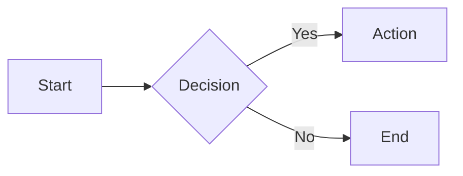
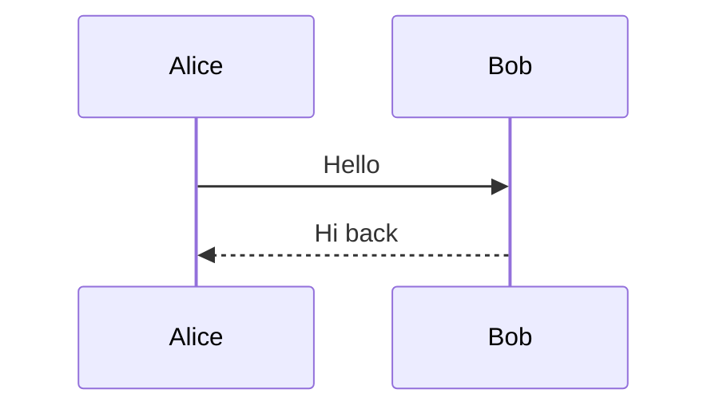
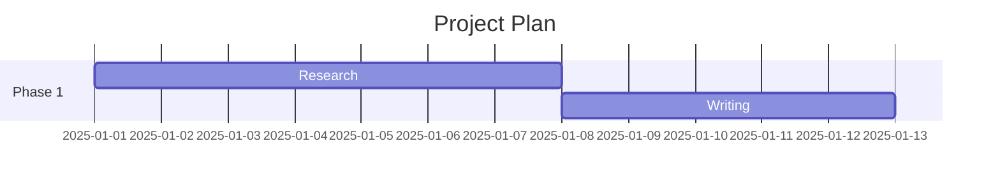
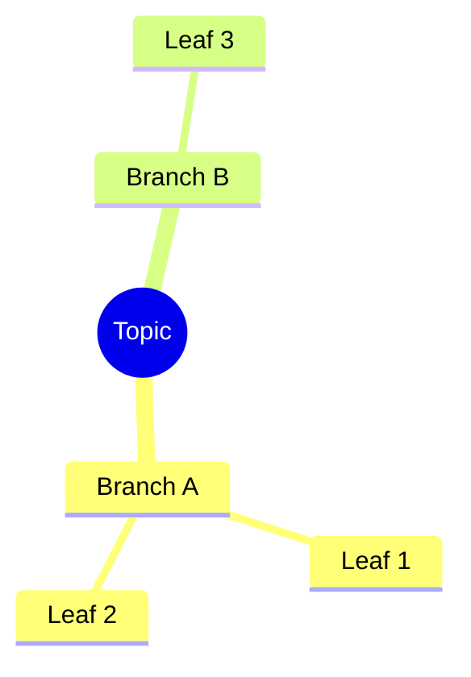

# Editing & Formatting Reference

## Basic Markdown Syntax

```markdown
# Heading 1
## Heading 2
### Heading 3
#### Heading 4

**bold**
*italic*
~~strikethrough~~
==highlight==
`inline code`

Horizontal rule:
---
```

## Code Blocks

````markdown
```python
def greet(name: str) -> str:
    return f"Hello, {name}"
```

```js
const greet = (name) => `Hello, ${name}`;
```

```bash
echo "hello"
```
````

## Lists

```markdown
- Unordered item
  - Nested item
    - Deeply nested

1. Ordered item
2. Second item
   1. Nested ordered

- [ ] Unchecked task
- [x] Checked task
```

## Tables

```markdown
| Column A | Column B | Column C |
|:---------|:--------:|---------:|
| left     | center   | right    |
| data     | data     | data     |
```

## Blockquotes

```markdown
> Single level quote
>
> > Nested quote
```

## Math (LaTeX)

```markdown
Inline: $E = mc^2$

Block:
$$
\int_{0}^{\infty} e^{-x^2} dx = \frac{\sqrt{\pi}}{2}
$$
```

## Mermaid Diagrams

````markdown







````

## Inline Comments

```markdown
%%This comment is invisible in Reading view%%
```

## Inline HTML & iframes

```markdown
<mark>highlighted text</mark>

<iframe src="https://example.com" width="600" height="400"></iframe>
```

## Views

- **Source mode**: raw markdown, no rendering
- **Live Preview**: renders as you type, click to edit
- **Reading view**: fully rendered, read-only feel

## Folding

Any heading or list item with children can be folded via the arrow in the gutter.
Enable via Settings > Editor > Fold heading / Fold indent.

## Multiple Cursors

Hold `Alt` (Windows/Linux) or `Option` (macOS) and click to place additional cursors.

---

## Callouts

All callout types. Add `+` to expand by default, `-` to collapse by default.

```markdown
> [!NOTE]
> Informational note.

> [!TIP]
> Helpful tip.

> [!WARNING]
> Proceed with caution.

> [!INFO]
> Additional context.

> [!SUCCESS]
> Goal achieved.

> [!QUESTION]
> Something to consider.

> [!FAILURE]
> Something went wrong.

> [!DANGER]
> High severity issue.

> [!BUG]
> Known bug.

> [!EXAMPLE]
> Concrete example.

> [!ABSTRACT]
> Summary or abstract.

> [!QUOTE]
> A quotation.
```

### Foldable Callouts

```markdown
> [!NOTE]+ Expanded by default
> This one starts open.

> [!WARNING]- Collapsed by default
> This one starts closed.
```

### Nested Callouts

```markdown
> [!INFO] Outer callout
> Outer content.
>
> > [!TIP] Nested callout
> > Inner content.
```

### Custom Callout Title

```markdown
> [!NOTE] My Custom Title
> Content here.
```

---

## Tags

```markdown
Inline tag: #tag
Nested tag: #parent/child/grandchild
```

YAML frontmatter tags (preferred for organization):

```yaml
---
tags:
  - tag-one
  - parent/child
---
```

---

## Properties (YAML Frontmatter)

Always at the very top of the note, wrapped in `---`.

### Property Types

| Type | Example value |
|---|---|
| text | `"My Note"` |
| number | `42` |
| date | `2025-03-15` |
| datetime | `2025-03-15T09:00` |
| boolean | `true` |
| list | `["item1", "item2"]` |

### Standard Properties

```yaml
---
title: Note Title
aliases:
  - Alternate Name
  - Short Name
tags:
  - topic/subtopic
date: 2025-03-15
created: 2025-03-15T09:00
modified: 2025-03-20T14:30
status: draft
type: note
cssclasses:
  - wide-page
---
```

---

## Attachments

```markdown
![[image.png]]
![[image.png|300]]
![[photo.jpg|600x400]]
![[recording.mp3]]
![[video.mp4]]
![[document.pdf]]
![[document.pdf#page=3]]
```

Resize by adding `|width` or `|widthxheight` after the filename.

---

## Hotkey Reference (macOS defaults)

| Action | Shortcut |
|---|---|
| Toggle bold | Cmd+B |
| Toggle italic | Cmd+I |
| Toggle code | Cmd+` |
| Insert link | Cmd+K |
| Toggle checklist | Cmd+L |
| Command palette | Cmd+P |
| Quick switcher | Cmd+O |
| Search in vault | Cmd+Shift+F |
| Toggle left sidebar | Cmd+[ |
| Toggle right sidebar | Cmd+] |
| New note | Cmd+N |
| Toggle reading view | Cmd+E |
